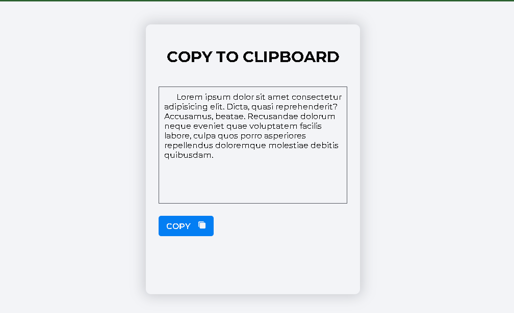

# Clipboard with Jquery

> This is a HTML project in which a user can see copy a text in an input. I used CSS and JQuery to complement it.

## Built With

- HTML
- CSS
- JQuery
## Live Demo

[Live Demo Link](https://rawcdn.githack.com/zainsadaqat/javascript-capstone-pokeapi/9c23e92fb394f561100659025d7f10774130146d/dist/index.html)

## Getting Started
1. Clone this repo on your local machine

2. In the path where your repository is located, you will open your terminal.

4. Enjoy.

### Prerequisites
To make this repository working in your local machine you need only a browser.

## Author

👤 **Valeria Ruiz**

- Github: [@ValRu99](https://github.com/ValRu99)

## 🤝 Contributing

Contributions, issues and feature requests are welcome!

Feel free to check the [issues page](https://github.com/ValRu99/clipboard_jquery_valeria_29jul23/issues).

## Show your support

Give a ⭐️ if you like this project!

## Show your support

Give a ⭐️ if you like this project!

## Acknowledgments

- Google: For letting us find crucial information in order to create this project.

## 📝 License

This project is [CC0-1.0](LIC ENSE) licensed.
